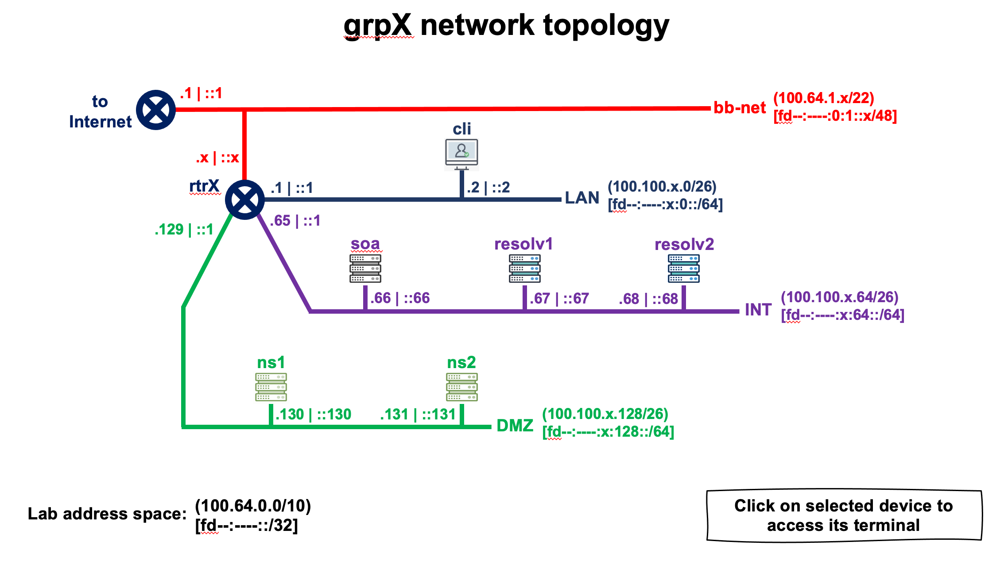

# Laboratory Network Topology (Group X)





```
  DEVICE NAME        IPv4 ADDRESS              IPv6 ADDRESS
+--------------+-----------------------+-----------------------------+
| grpX-resolv1 | 100.100.X.67 (eth0)   | fd89:59e0:X:64::67 (eth0)   |
+--------------+-----------------------+-----------------------------+
| grpX-resolv2 | 100.100.X.68 (eth0)   | fd89:59e0:X:64::68 (eth0)   |
+--------------+-----------------------+-----------------------------+
| grpX-rtr     | 100.64.1.X (eth0)     | fd89:59e0:X::1 (eth1)       |
|              | 100.100.X.65 (eth2)   | fd89:59e0:X:64::1 (eth2)    |
|              | 100.100.X.193 (eth4)  | fd89:59e0:X:192::1 (eth4)   |
|              | 100.100.X.129 (eth3)  | fd89:59e0:X:128::1 (eth3)   |
|              | 100.100.X.1 (eth1)    | fd89:59e0:0:1::X (eth0)     |
+--------------+-----------------------+-----------------------------+
```


During this exercise, we will use only the following devices:

* **grpX-resolv1** & **grpX-resolv2**: recursive DNS servers (resolvers)


# Configure a Recursive Server (BIND)

For this purpose, we will use the "Resolv 1" server (resolver) [**grpX-resolv1**].

In this laboratory, we use BIND9, open-source software developed and maintained by the nonprofit organization Internet Systems Consortium (ISC). If you use BIND9 for commercial purposes, we encourage you to contribute.

To install BIND9, use the following command:

```
$ sudo apt install -y bind9
```

The command will most likely fail. This is because name resolution is not working yet, since none of our recursive servers is currently operational. Fortunately, several public resolvers are available on the Internet and can be used temporarily.

In our case, we will use 9.9.9.9.

To do this, rename */etc/resolv.conf* to */etc/resolv.conf.orig* so that we can restore it later, once our resolver is operational.

```
$ sudo mv /etc/resolv.conf /etc/resolv.conf.orig
```

Then configure the system to use 9.9.9.9 temporarily:

```
$ echo "nameserver 9.9.9.9"|sudo tee /etc/resolv.conf
```

Now try the BIND9 installation command again:

```
$ sudo apt install -y bind9
```

Once it is installed, we must create a bind user, which BIND9 will use to run:

```
$ sudo adduser sysadm bind
```

> [!TIP]
>
> Close and reopen the terminal window. The new user permissions take effect only after you log out and log back in.


Now we will configure BIND9 itself. To do so, go to the */etc/bind* directory:

```
$ cd /etc/bind
```

At this point, we must configure some BIND9 options.
To do so, edit the /etc/bind/named.conf.options file:

```
$ sudo nano named.conf.options
```

Now add the options that specify which IP addresses may send DNS queries to the resolver and, at the same time, on which IP addresses (interfaces) the server will listen on port 53. The final file should look similar to the following:

```
options {
        directory "/var/cache/bind";
        dnssec-validation auto;
        listen-on port 53 { any; };
        listen-on-v6 port 53 { any; };
        allow-query { localhost; 100.100.0.0/16; fd89:59e0::/32; };
        recursion yes;
};
```

After editing the configuration file, run a command that quickly checks whether the configuration is semantically correct. If the command returns no output, it means that no errors were found in the configuration files:

```
$ named-checkconf
```

Finally, restart the server so that it applies the configuration changes:

```
$ sudo systemctl restart named
```

Then check the status of the BIND9 process:

```
$ sudo systemctl status named
```

You should obtain output similar to the following:

```
* named.service - BIND Domain Name Server
   Loaded: loaded (/lib/systemd/system/named.service; enabled; vendor preset: enabled)
  Drop-In: /etc/systemd/system/service.d
       └─lxc.conf
   Active: **active (running)** since Thu 2021-05-13 01:38:27 UTC; 4s ago
    Docs: man:named(8)
  Main PID: 849 (named)
   Tasks: 50 (limit: 152822)
   Memory: 103.2M
   CGroup: /system.slice/named.service
       └─849 /usr/sbin/named -f -u bind

May 13 01:38:27 resolv1.grpX.napco.te-labs.training named[849]: **command channel listening on ::1#953**
May 13 01:38:27 resolv1.grpX.napco.te-labs.training named[849]: managed-keys-zone: loaded serial 6
May 13 01:38:27 resolv1.grpX.napco.te-labs.training named[849]: zone 0.in-addr.arpa/IN: loaded serial 1
May 13 01:38:27 resolv1.grpX.napco.te-labs.training named[849]: zone 127.in-addr.arpa/IN: loaded serial 1
May 13 01:38:27 resolv1.grpX.napco.te-labs.training named[849]: zone localhost/IN: loaded serial 2
May 13 01:38:27 resolv1.grpX.napco.te-labs.training named[849]: zone 255.in-addr.arpa/IN: loaded serial 1
May 13 01:38:27 resolv1.grpX.napco.te-labs.training named[849]: **all zones loaded**
May 13 01:38:27 resolv1.grpX.napco.te-labs.training named[849]: **running**
May 13 01:38:27 resolv1.grpX.napco.te-labs.training named[849]: managed-keys-zone: Key 20326 for zone . is now trusted (acceptance timer>
May 13 01:38:27 resolv1.grpX.napco.te-labs.training named[849]: resolver priming query complete
```


Finally, restore the original */etc/resolv.conf* file so that the system uses the recursive servers we installed ourselves. Remember that we were temporarily using 9.9.9.9:

```
$ sudo mv /etc/resolv.conf.orig /etc/resolv.conf
```


# Recursive Server Tests


```
$ dig @localhost
```

```
; <<>> DiG 9.16.1-Ubuntu <<>> @localhost
; (2 servers found)
;; global options: +cmd
;; Got answer:
;; ->>HEADER<<- opcode: QUERY, status: NOERROR, id: 55915
;; flags: qr rd ra ad; QUERY: 1, ANSWER: 13, AUTHORITY: 0, ADDITIONAL: 27

;; OPT PSEUDOSECTION:
; EDNS: version: 0, flags:; udp: 4096
; COOKIE: 8740b0c9dd1815aa0100000061659efc472f899125a594b4 (good)
;; QUESTION SECTION:
;.				IN	NS

;; ANSWER SECTION:
.			518400	IN	NS	g.root-servers.net.
.			518400	IN	NS	m.root-servers.net.
.			518400	IN	NS	e.root-servers.net.
.			518400	IN	NS	b.root-servers.net.
.			518400	IN	NS	d.root-servers.net.
.			518400	IN	NS	c.root-servers.net.
.			518400	IN	NS	j.root-servers.net.
.			518400	IN	NS	f.root-servers.net.
.			518400	IN	NS	h.root-servers.net.
.			518400	IN	NS	i.root-servers.net.
.			518400	IN	NS	a.root-servers.net.
.			518400	IN	NS	k.root-servers.net.
.			518400	IN	NS	l.root-servers.net.

;; ADDITIONAL SECTION:
m.root-servers.net.	518400	IN	A	202.12.27.33
l.root-servers.net.	518400	IN	A	199.7.83.42
k.root-servers.net.	518400	IN	A	193.0.14.129
j.root-servers.net.	518400	IN	A	192.58.128.30
i.root-servers.net.	518400	IN	A	192.36.148.17
h.root-servers.net.	518400	IN	A	198.97.190.53
g.root-servers.net.	518400	IN	A	192.112.36.4
f.root-servers.net.	518400	IN	A	192.5.5.241
e.root-servers.net.	518400	IN	A	192.203.230.10
d.root-servers.net.	518400	IN	A	199.7.91.13
c.root-servers.net.	518400	IN	A	192.33.4.12
b.root-servers.net.	518400	IN	A	199.9.14.201
a.root-servers.net.	518400	IN	A	198.41.0.4
m.root-servers.net.	518400	IN	AAAA	2001:dc3::35
l.root-servers.net.	518400	IN	AAAA	2001:500:9f::42
k.root-servers.net.	518400	IN	AAAA	2001:7fd::1
j.root-servers.net.	518400	IN	AAAA	2001:503:c27::2:30
i.root-servers.net.	518400	IN	AAAA	2001:7fe::53
h.root-servers.net.	518400	IN	AAAA	2001:500:1::53
g.root-servers.net.	518400	IN	AAAA	2001:500:12::d0d
f.root-servers.net.	518400	IN	AAAA	2001:500:2f::f
e.root-servers.net.	518400	IN	AAAA	2001:500:a8::e
d.root-servers.net.	518400	IN	AAAA	2001:500:2d::d
c.root-servers.net.	518400	IN	AAAA	2001:500:2::c
b.root-servers.net.	518400	IN	AAAA	2001:500:200::b
a.root-servers.net.	518400	IN	AAAA	2001:503:ba3e::2:30

;; Query time: 0 msec
;; SERVER: 127.0.0.1#53(127.0.0.1)
;; WHEN: Tue Oct 12 11:43:08 -03 2021
;; MSG SIZE  rcvd: 851

```


```
$ dig nic.mx
```

```
;; Query time: 0 msec
;; SERVER: 127.0.0.1#53(127.0.0.1)
;; WHEN: Tue Oct 12 11:43:08 -03 2021
;; MSG SIZE  rcvd: 851

root@resolv1:~# dig @localhost nic.mx

; <<>> DiG 9.16.1-Ubuntu <<>> @localhost nic.mx
; (2 servers found)
;; global options: +cmd
;; Got answer:
;; ->>HEADER<<- opcode: QUERY, status: NOERROR, id: 3299
;; flags: qr rd ra; QUERY: 1, ANSWER: 4, AUTHORITY: 0, ADDITIONAL: 1

;; OPT PSEUDOSECTION:
; EDNS: version: 0, flags:; udp: 4096
; COOKIE: 0fcfbbd2121bbef90100000061659f22310637fc9df339a1 (good)
;; QUESTION SECTION:
;nic.mx.				IN	A

;; ANSWER SECTION:
nic.mx.			300	IN	A	200.94.180.58
nic.mx.			300	IN	A	200.94.180.60
nic.mx.			300	IN	A	200.94.180.59
nic.mx.			300	IN	A	200.94.180.61

;; Query time: 1072 msec
;; SERVER: 127.0.0.1#53(127.0.0.1)
;; WHEN: Tue Oct 12 11:43:46 -03 2021
;; MSG SIZE  rcvd: 127
```


#### Testing DNSSEC

```
$ dig nic.br +dnssec +multi
```

```
; <<>> DiG 9.16.1-Ubuntu <<>> @localhost nic.br +dnssec +multi
; (2 servers found)
;; global options: +cmd
;; Got answer:
;; ->>HEADER<<- opcode: QUERY, status: NOERROR, id: 15259
;; flags: qr rd ra ad; QUERY: 1, ANSWER: 2, AUTHORITY: 0, ADDITIONAL: 1

;; OPT PSEUDOSECTION:
; EDNS: version: 0, flags: do; udp: 4096
; COOKIE: 191c41a103551a480100000061659f8b67a5400faa328bae (good)
;; QUESTION SECTION:
;nic.br.			IN A

;; ANSWER SECTION:
nic.br.			86400 IN A 200.160.4.6
nic.br.			86400 IN RRSIG A 13 2 86400 (
				20211111003007 20210902000957 47828 nic.br.
				T1t0WmNTQlHt8MNGoAk450qLwXo3uOBOzLVwzBJV8dLR
				/GbQ3JQ2bKn+NuJFhYpkYJXYefE28tquuO8c7mFWUA== )

;; Query time: 128 msec
;; SERVER: 127.0.0.1#53(127.0.0.1)
;; WHEN: Tue Oct 12 11:45:31 -03 2021
;; MSG SIZE  rcvd: 181
```


#### Checking the Resource Records Associated with DNSSEC

```
$ dig nic.br DNSKEY +dnssec +multi
```

```
; <<>> DiG 9.16.1-Ubuntu <<>> @localhost nic.br DNSKEY +dnssec +multi
; (2 servers found)
;; global options: +cmd
;; Got answer:
;; ->>HEADER<<- opcode: QUERY, status: NOERROR, id: 24669
;; flags: qr rd ra ad; QUERY: 1, ANSWER: 2, AUTHORITY: 0, ADDITIONAL: 1

;; OPT PSEUDOSECTION:
; EDNS: version: 0, flags: do; udp: 4096
; COOKIE: 4e1d3c3d95de4fbf010000006165a02423650ab53677792d (good)
;; QUESTION SECTION:
;nic.br.			IN DNSKEY

;; ANSWER SECTION:
nic.br.			86247 IN DNSKEY	257 3 13 (
				sx7bpmRgLGo1UkU4RGsUrC4pHTzZg00brXcuvA2VtxpR
				MzskwyO6jE7U1vSmZ2JM8oALXpBZVTMcGpMxC43Z4g==
				) ; KSK; alg = ECDSAP256SHA256 ; key id = 47828
nic.br.			86247 IN RRSIG DNSKEY 13 2 86400 (
				20211122020702 20210913012826 47828 nic.br.
				QIkq+BDIrgk80VMBXMFakL7TE2f+dvmO50sONqo/ryOe
				6bwhm3gXQ+HC2kp0SKHuBf5gd+CA7FC382xPq1xH0g== )

;; Query time: 0 msec
;; SERVER: 127.0.0.1#53(127.0.0.1)
;; WHEN: Tue Oct 12 11:48:04 -03 2021
;; MSG SIZE  rcvd: 245
```


```
$ dig nic.br DS +multi
```

```
; <<>> DiG 9.16.1-Ubuntu <<>> @localhost nic.br DS +multi
; (2 servers found)
;; global options: +cmd
;; Got answer:
;; ->>HEADER<<- opcode: QUERY, status: NOERROR, id: 46272
;; flags: qr rd ra ad; QUERY: 1, ANSWER: 1, AUTHORITY: 0, ADDITIONAL: 1

;; OPT PSEUDOSECTION:
; EDNS: version: 0, flags:; udp: 4096
; COOKIE: d64cacc54d19278b010000006165a0710daca9d1ebf2cd42 (good)
;; QUESTION SECTION:
;nic.br.			IN DS

;; ANSWER SECTION:
nic.br.			3370 IN	DS 47828 13 2 (
				B9BEC0EAC0F064929C8586DB185537787015EC3A48F0
				894BEA74DEEA452F3060 )

;; Query time: 0 msec
;; SERVER: 127.0.0.1#53(127.0.0.1)
;; WHEN: Tue Oct 12 11:49:21 -03 2021
;; MSG SIZE  rcvd: 111
```


#### Creating a DNSSEC Exception

A zone may break because of problems with its DNSSEC configuration. In that case, recursive resolvers performing DNSSEC validation may return DNS responses with a SERVFAIL status. Users behind those recursive resolvers will be affected when accessing those domains. Although fixing the problem is generally the responsibility of the domain administrator, the recursive resolver administrator can temporarily disable DNSSEC validation for the affected domain that is failing validation.


First, query a domain with an invalid signature, which is provided for testing purposes:

```
$ dig dnssec-failed.org
```

```
; <<>> DiG 9.16.1-Ubuntu <<>> @localhost dnssec-failed.org
; (2 servers found)
;; global options: +cmd
;; Got answer:
;; ->>HEADER<<- opcode: QUERY, status: SERVFAIL, id: 58931
;; flags: qr rd ra; QUERY: 1, ANSWER: 0, AUTHORITY: 0, ADDITIONAL: 1

;; OPT PSEUDOSECTION:
; EDNS: version: 0, flags:; udp: 4096
; COOKIE: 63d65947da7897cb010000006165a11dd39404eb647487aa (good)
;; QUESTION SECTION:
;dnssec-failed.org.		IN	A

;; Query time: 2672 msec
;; SERVER: 127.0.0.1#53(127.0.0.1)
;; WHEN: Tue Oct 12 11:52:13 -03 2021
;; MSG SIZE  rcvd: 74
```


In BIND, enter the exception by using the "***rndc nta***" command-line tool:

```
$ sudo rndc nta dnssec-failed.org
```


You can display a list of all configured NTAs (exceptions):

```
$ sudo rndc nta -dump
```


Now run the query again after adding the exception:

```
$ dig @localhost dnssec-failed.org
```

***What happens?***
