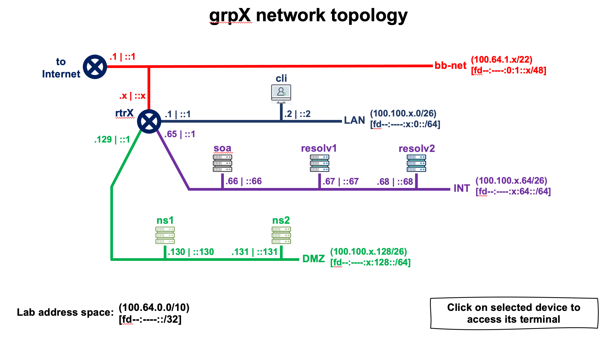

# DNS Resolver Lab (using UNBOUND)

------

> (2026-02-27) 
> Nicolas Antoniello (@65007)

------


## Lab Topology (Group X) 





```
  DEVICE NAME        IPv4 ADDRESS              IPv6 ADDRESS
+--------------+-----------------------+-----------------------------+
| grpX-cli     | 100.100.X.2 (eth0)    | fd8c:c9b5:X::2 (eth0)       |
+--------------+-----------------------+-----------------------------+
| grpX-resolv1 | 100.100.X.67 (eth0)   | fd8c:c9b5:X:64::67 (eth0)   |
+--------------+-----------------------+-----------------------------+
| grpX-resolv2 | 100.100.X.68 (eth0)   | fd8c:c9b5:X:64::68 (eth0)   |
+--------------+-----------------------+-----------------------------+
| grpX-rtr     | 100.64.1.X (eth0)     | fd8c:c9b5:X::1 (eth1)       |
|              | 100.100.X.65 (eth2)   | fd8c:c9b5:X:64::1 (eth2)    |
|              | 100.100.X.193 (eth4)  | fd8c:c9b5:X:192::1 (eth4)   |
|              | 100.100.X.129 (eth3)  | fd8c:c9b5:X:128::1 (eth3)   |
|              | 100.100.X.1 (eth1)    | fd8c:c9b5:0:1::X (eth0)     |
+--------------+-----------------------+-----------------------------+
```

During this practice we are only going to access the following equipment:

* **grpX-cli** : client (optional)
* **grpX-resolv2** : recursive server (resolver) with preinstalled UNBOUND


# Setting up recursive server (Unbound)

We use the container "*resolv2*" (recursive server) [**grpX-resolv2**].

This container already has the UNBOUND packages downloaded and installed.

We switch to the root user:

```
$ sudo su -
```

Unbound normally uses at least configuration file `unbound.conf`. You should find it located in `/etc/unboud`.

In its default state (after fresh install) Unbound resolver should not answer queries.

We go to the /etc/unbound directory:

```
# cd /etc/unbound
```

At this point we must configure some UNBOUND options.
To do this we edit the file /etc/unbound/unbound.conf:

```
# nano unbound.conf
```

Now we add the options to indicate (when resolving) which are the interfaces on which it will listen for queries, the IP addresses that will be able to send it DNS queries, the port it will use (53), and some other parameters. The file should be as follows:

```
# Unbound configuration file for Debian.
#
# See the unbound.conf(5) man page.
#
# See /usr/share/doc/unbound/examples/unbound.conf for a commented
# reference config file.
#
# The following line includes additional configuration files from the
# /etc/unbound/unbound.conf.d directory.

server:
        interface: 0.0.0.0
        interface: ::0

        access-control: 127.0.0.0/8 allow
        access-control: 100.100.0.0/16 allow
        access-control: fd8c:c9b5::/32 allow

        port: 53

        do-udp: yes
        do-tcp: yes
        do-ip4: yes
        do-ip6: yes
        
remote-control:
				control-enable: yes

include: "/etc/unbound/unbound.conf.d/*.conf"
```

The purpose of *remote-control* section is to allow secure, command-line administration of a running Unbound instance. It enables tasks like `unbound-control reload`, `unbound-control flush`, or `unbound-control stats`. As it uses TLS encryption for security, we must run `unbound-control-setup` to generate the required server key, `server.pem`, `control.key`, and `control.pem` files. By default, it usually only allows connections from `localhost` (127.0.0.1).

An example of further configuration parameters in the *unbound.conf* file may look like:
(***This is an example; we're not adding this to the configuration at this point!***)

```
remote-control:
    control-enable: yes
    control-interface: 127.0.0.1
    control-port: 8953
    server-key-file: "/etc/unbound/unbound_server.key"
    server-cert-file: "/etc/unbound/unbound_server.pem"
    control-key-file: "/etc/unbound/unbound_control.key"
    control-cert-file: "/etc/unbound/unbound_control.pem"
```

Now let's create necessary files for unbound-control:

```
# unbound-control-setup
```

Once we finish editing the configuration file, we execute a command that allows us to quickly check if the configuration is semantically correct:

```
# unbound-checkconf
```

If it is correct, it will return something similar to the following:

```
unbound-checkconf: no errors in /etc/unbound/unbound.conf
```

Finally we restart the server so that it takes the configuration changes:

```
# systemctl restart unbound
```

And we check the status of the UNBOUND process:

```
# systemctl status unbound
```

We should obtain an output similar to the following:

```
● unbound.service - Unbound DNS server
     Loaded: loaded (/lib/systemd/system/unbound.service; enabled; vendor preset: enabled)
    Drop-In: /run/systemd/system/service.d
             └─zzz-lxc-service.conf
     Active: active (running) since Wed 2023-10-11 20:31:49 UTC; 5s ago
       Docs: man:unbound(8)
    Process: 461 ExecStartPre=/usr/lib/unbound/package-helper chroot_setup (code=exited, status=0/SUCCESS)
    Process: 464 ExecStartPre=/usr/lib/unbound/package-helper root_trust_anchor_update (code=exited, status=0/SUCCESS)
   Main PID: 468 (unbound)
      Tasks: 1 (limit: 19180)
     Memory: 6.4M
     CGroup: /system.slice/unbound.service
             └─468 /usr/sbin/unbound -d

Oct 11 20:31:49 resolv2.grp1.lac.te-labs.training systemd[1]: Starting Unbound DNS server...
Oct 11 20:31:49 resolv2.grp1.lac.te-labs.training package-helper[467]: /var/lib/unbound/root.key has content
Oct 11 20:31:49 resolv2.grp1.lac.te-labs.training package-helper[467]: success: the anchor is ok
Oct 11 20:31:49 resolv2.grp1.lac.te-labs.training unbound[468]: [468:0] notice: init module 0: subnet
Oct 11 20:31:49 resolv2.grp1.lac.te-labs.training unbound[468]: [468:0] notice: init module 1: validator
Oct 11 20:31:49 resolv2.grp1.lac.te-labs.training unbound[468]: [468:0] notice: init module 2: iterator
Oct 11 20:31:49 resolv2.grp1.lac.te-labs.training unbound[468]: [468:0] info: start of service (unbound 1.9.4).
Oct 11 20:31:49 resolv2.grp1.lac.te-labs.training systemd[1]: Started Unbound DNS server.
```


Alternatively we can check the status of Unbound using the *unbound-control* tool:

```
# unbound-control status
```

```
version: 1.19.2
verbosity: 1
threads: 1
modules: 3 [ subnetcache validator iterator ]
uptime: 10 seconds
options: reuseport control(ssl)
unbound (pid 10445) is running...
```


Lets now quickly test our new resolver:

```
# dig @localhost com. SOA +noall +answer
```

